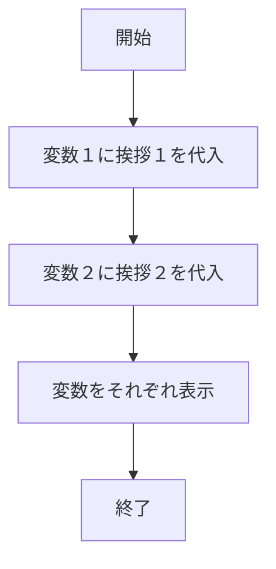
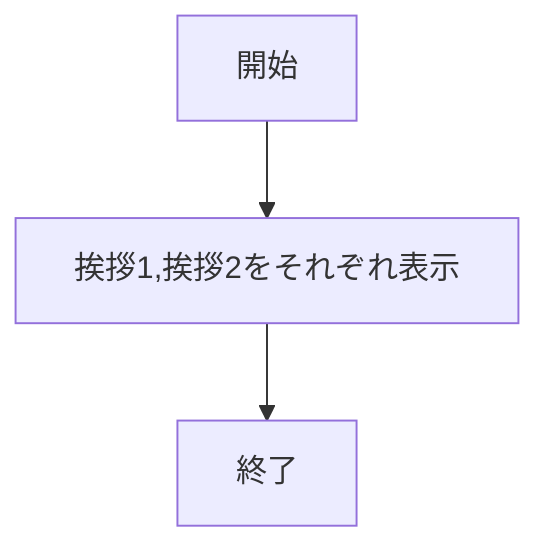
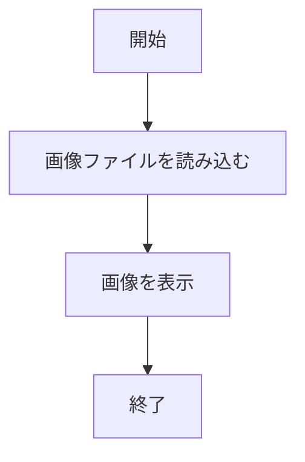
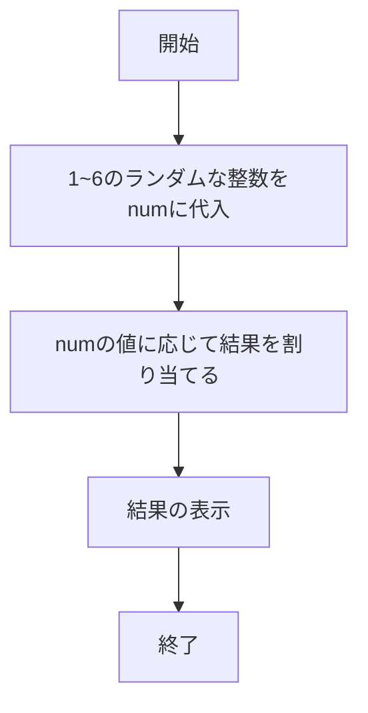
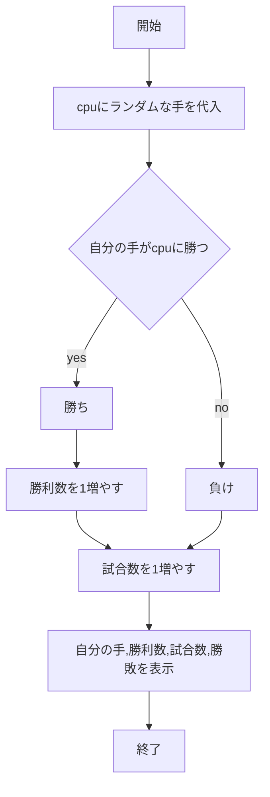
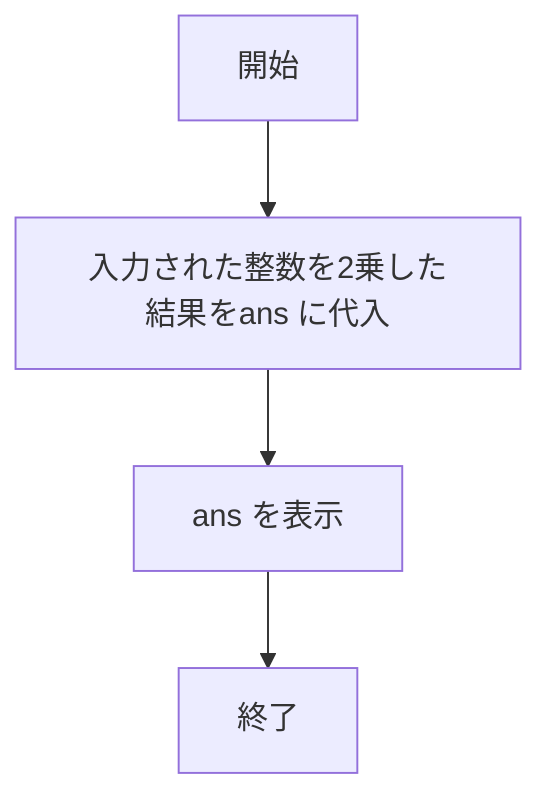

# webpro_06
2024/10/29


## 挨拶１

### ファイル一覧

ファイル名 | 説明
-|-
app5.js | プログラム本体
views/show.ejs | 挨拶１のejsファイル

### 使用手順

1. app5.js を起動する
1. Webブラウザでlocalhost:8080/hello1 にアクセスする

### フローチャート




## 挨拶２

### ファイル一覧

ファイル名 | 説明
-|-
app5.js | プログラム本体
views/show.ejs | 挨拶２のejsファイル

### 使用手順

1. app5.js を起動する
1. Webブラウザでlocalhost:8080/hello2 にアクセスする

### フローチャート




## アイコン

### ファイル一覧

ファイル名 | 説明
-|-
app5.js | プログラム本体
views/icon.ejs | アイコンのejsファイル
views/Apple_logo_black.svg | 表示する画像ファイル

### 使用手順

1. app5.js を起動する
1. Webブラウザでlocalhost:8080/icon にアクセスする

### フローチャート




## おみくじ

### ファイル一覧

ファイル名 | 説明
-|-
app5.js | プログラム本体
views/luck.ejs | おみくじのejsファイル

### 使用方法

1. app5.js を起動する
1. Webブラウザでlocalhost:8080/luck にアクセスする

### フローチャート




## じゃんけん

### ファイル一覧

ファイル名 | 説明
-|-
app5.js | プログラム本体
public/janken.html | じゃんけんの開始画面
views/janken.ejs | じゃんけんのejsファイル

### 使用手順

1. app5.js を起動する
1. Webブラウザでlocalhost:8080/public/janken.html にアクセスする
1. 自分の手を入力する

### フローチャート




## 二乗

### ファイル一覧

ファイル名 | 説明
-|-
app5.js | プログラム本体
public/squar.html | 二乗の開始画面
views/squar.ejs | 二乗のejsファイル

### 使用方法

1. app5.js を起動する
1. Webブラウザでlocalhost:8080/public/squar.html にアクセスする
1. 2乗したい整数を入力する

### フローチャート




## 性格診断

### ファイル一覧

ファイル名 | 説明
-|-
app5.js | プログラム本体
views/color.ejs | 性格診断のejsファイル

### 使用方法

1. app5.js を起動する
1. Webブラウザでlocalhost:8080/color にアクセスする

### フローチャート

```mermaid
flowchart TD;

start["開始"]
one["入力された値から色を判別"]
two["色に応じた文章をans に代入"]
three["ans を表示]
end1["終了"]

start --> one
one --> two
two --> three
three --> end1
```